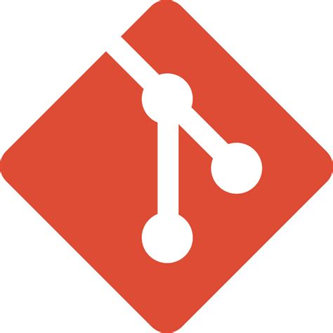
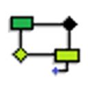

# Repositório de modelagem de dados

  
  <h2 style="margin: 0;">Desafios do curso Heineken - Inteligência Artificial Aplicada a Dados com Copilot em parceria da DIO e Heineken.</h2>

 

## E-commerce

> Para informações sobre a modelagem da atividade de e-commerce, click aqui ->
[e-commerce](e-commerce/README.md)

> Para acessar diretamente o modelo conceitual, click aqui ->
[Modelo Conceitual](e-commerce/Modelo_conceitual.md)

> Para acessar diretamente o modelo lógico, click aqui ->
[Modelo Lógico](e-commerce/Modelo_logico.md)

> Para acessar diretamente o modelo físico, click aqui ->
[Modelo Físico](e-commerce/Modelo_fisico.md)

> Para informações sobre carga de dados de teste, click aqui ->
[Carga de Dados para Teste](e-commerce/Base_dados.md)

> Para acessar documentação sobre consultas ao banco de dados, click aqui ->
[Exemplos consultas](e-commerce/Consultas_SQL.md)

 

## Oficina

> Para informações sobre a modelagem da atividade de Oficina, click aqui -> 
[Oficina](oficina/README.md)

> Para acessar diretamente o modelo conceitual, click aqui ->
[Modelo Conceitual](oficina/Modelo_conceitual.md)

> Para acessar diretamente o modelo lógico, click aqui ->
[Modelo Lógico](oficina/Modelo_logico.md)

> Para acessar diretamente o modelo físico, click aqui ->
[Modelo Físico](oficina/Modelo_fisico.md)

> Para informações sobre carga de dados de teste, click aqui ->
[Carga de Dados para Teste](oficina/Base_dados.md)

> Para acessar documentação sobre consultas ao banco de dados, click aqui ->
[Exemplos consultas](oficina/Consultas_SQL.md)

 

## Script de atualização de arquivo .md e pre-commit hook

> Para informações sobre a script de atualização de arquivo .md e pre-commit hook, click aqui -> 
[Script de Atualização de Arquivo .md](Script_atualizacao_md.md)

 

## Tecnologias utilizadas

  
  <h2 style="margin: 0;">Git</h2>

  
  <h2 style="margin: 0;">Github</h2>

  
  <h2 style="margin: 0;">Sublime</h2>

  
  <h2 style="margin: 0;">VSCode</h2>

  
  <h2 style="margin: 0;">Docker</h2>

  
  <h2 style="margin: 0;">MySQL</h2>

  
  <h2 style="margin: 0;">brModelo</h2>

  
  <h2 style="margin: 0;">DBeaver</h2>

  
  <h2 style="margin: 0;">DbSchema</h2>

  
  <h2 style="margin: 0;">Git Bash</h2>

  
  <h2 style="margin: 0;">Claude.AI</h2>

