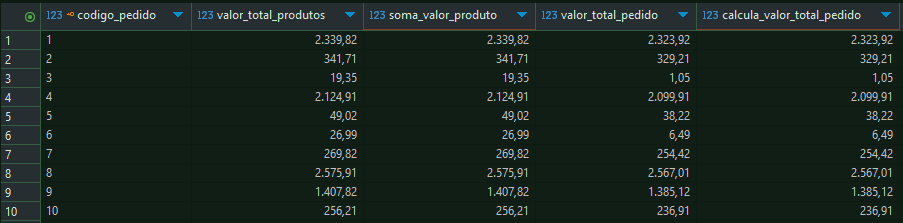
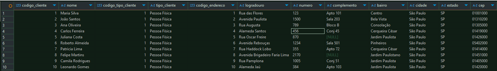
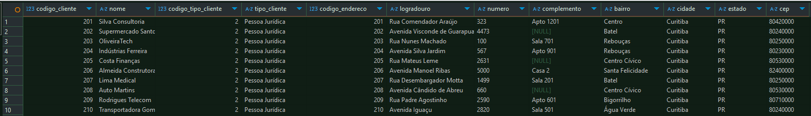

# Exemplos de consultas que podem ser realizadas na base de dados


### Verificar consistência de valores entre as tabelas compra e pedido  

```sql
SELECT 
	cpr.codigo_compra
	,cpr.valor_total_compra
	,SUM(ped.valor_total_pedido) as valor_total_pedido
	,COUNT(ped.codigo_pedido) as quant_pedido_compra

FROM 
	tb_compra as cpr
	LEFT JOIN tb_pedido as ped on (cpr.codigo_compra = ped.codigo_compra)
	
GROUP BY 1, 2	

HAVING
	cpr.valor_total_compra <> valor_total_pedido
```
#### Consulta sem a cláusula HAVING exibindo valores consistentes entre Compra e Pedido
#### Retorna da consulta


<br>

### Verificar consistência de valores entre as tabelas pedido e detalhamento do pedido

```sql

WITH consolidado_detalhamento_pedido as

	(SELECT 	
		dped.codigo_pedido
		,SUM((dped.preco_venda * dped.quantidade_produto) - dped.valor_desconto) as soma_valor_produto
	FROM tb_detalhamento_pedido as dped 
	GROUP BY 1
	)
	

SELECT 
	ped.codigo_pedido
	,ped.valor_total_produtos
	,dped.soma_valor_produto
	,ped.valor_total_pedido 
	,(ped.valor_total_produtos - ped.valor_frete - ped.desconto_pedido) as calcula_valor_total_pedido
	
FROM 
	tb_pedido as ped 
	LEFT JOIN consolidado_detalhamento_pedido as dped on (ped.codigo_pedido =dped.codigo_pedido) 
	
WHERE 
	ped.valor_total_produtos <> dped.soma_valor_produto 
	OR ped.valor_total_pedido <> (ped.valor_total_produtos - ped.valor_frete - ped.desconto_pedido)
```

#### Consulta sem a cláusula WHERE exibindo valores consistentes entre Pedido e Detalhamento de Pedido
#### Retorna da consulta



<br>

### Consulta Consolidada por Vendedor e Produto

#### Para facilicar consultas e reutilização em outras consultas foi criado uma view

```sql
CREATE VIEW IF NOT EXISTS vw_total_vendas_vendedor_produto as (
	SELECT
		dped.codigo_vendedor 
		,vpj.nome_fantasia as vendedor
		,dped.codigo_produto
		,prod.descricao as descricao_produto
		,SUM(dped.preco_venda * dped.quantidade_produto) as total_venda_sem_desconto
		,SUM(dped.valor_desconto) as total_desconto
		,SUM((dped.preco_venda * dped.quantidade_produto) - dped.valor_desconto) as total_venda_com_desconto
		
	FROM 
		tb_detalhamento_pedido as dped 
		LEFT JOIN tb_vendedor vend on (dped.codigo_vendedor = vend.codigo_vendedor)
		LEFT JOIN tb_pessoa_juridica vpj on (vend.codigo_pessoa_juridica = vpj.codigo_pessoa_juridica)
		LEFT JOIN tb_produto as prod on (dped.codigo_produto = prod.codigo_produto)
		
	GROUP BY 1, 2, 3, 4
	
	ORDER BY
		dped.codigo_vendedor
		,dped.codigo_produto
);
```

#### Consulta na view de Vendedor e Produtos

```sql
SELECT 
	vvp.*
	
FROM 
	vw_total_vendas_vendedor_produto as vvp
```
#### Retorna da consulta


<br>

### Consulta Consolidada por Produto

#### Para facilicar consultas e reutilização em outras consultas foi criado uma view

```sql
CREATE VIEW IF NOT EXISTS vw_total_vendas_produto as (
	SELECT 
		vp.codigo_produto
		,vp.descricao_produto
		,sum(vp.total_venda_sem_desconto) as total_venda_sem_desconto
		,sum(vp.total_desconto) as total_desconto
		,sum(vp.total_venda_com_desconto) as total_venda_com_desconto
		
	FROM 
		vw_total_vendas_vendedor_produto as vp
		
	GROUP BY 1, 2	
);

```

#### Consulta na view de Produtos

```sql
SELECT 
	vp.*
	
FROM 
	vw_total_vendas_produto as vp
```

#### Retorna da consulta


<br>


### Consulta consolidade de Clientes Pessoa Física e Pessoa Jurídica

#### Para facilicar consultas e reutilização em outras consultas foi criado uma view

```sql
CREATE VIEW IF NOT EXISTS vw_cliente_consolidado as (

	SELECT
		cli.codigo_cliente
		,IFNULL(pf.nome, tpj.nome_fantasia) as nome
		,CASE 
			WHEN pf.nome IS NOT NULL THEN 1
			WHEN tpj.nome_fantasia IS NOT NULL THEN 2
			ELSE 0
		END as codigo_tipo_cliente
		,CASE 
			WHEN pf.nome IS NOT NULL THEN 'Pessoa Física'
			WHEN tpj.nome_fantasia IS NOT NULL THEN 'Pessoa Jurídica'
			ELSE 'Tipo não Identicado'
		END as tipo_cliente
		,endr.*
		
	
	FROM
		tb_cliente	as cli
		LEFT JOIN tb_cliente_pessoa_fisica as pf on (cli.codigo_cliente = pf.codigo_cliente)
		LEFT JOIN tb_cliente_pessoa_juridica as pj on (cli.codigo_cliente = pj.codigo_cliente) 
		LEFT JOIN tb_pessoa_juridica tpj on (pj.codigo_pessoa_juridica = tpj.codigo_pessoa_juridica ) 
		INNER JOIN tb_endereco endr on (cli.codigo_endereco = endr.codigo_endereco)
);	
```

#### Consulta na view de Clientes consolidado Pessoa Física e Jurídica

```sql
SELECT 
	cc.*
	
FROM 
	vw_cliente_consolidado as cc
```

#### Retorna da consulta



#### Consulta na view de Clientes consolidado somente Pessoa Jurídica

```sql
SELECT 
	cc.*
	
FROM 
	vw_cliente_consolidado as cc
	
WHERE
	cc.codigo_tipo_cliente = 2	
```

#### Retorna da consulta



<br>

### Nome consulta

```sql
```

<br>

### Nome consulta

```sql
```

<br>

### Nome consulta

```sql
```

<br>

### Nome consulta

```sql
```

<br>

### Nome consulta

```sql
```

<br>

### Nome consulta

```sql
```

<br>


<br>

[Retornar README principal](../README.md)