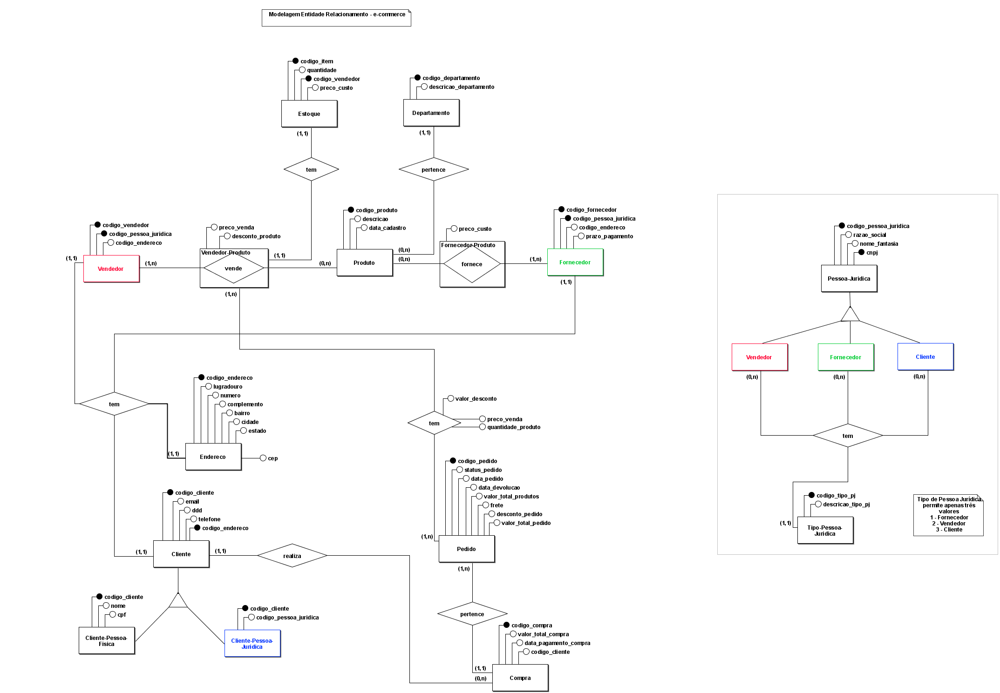
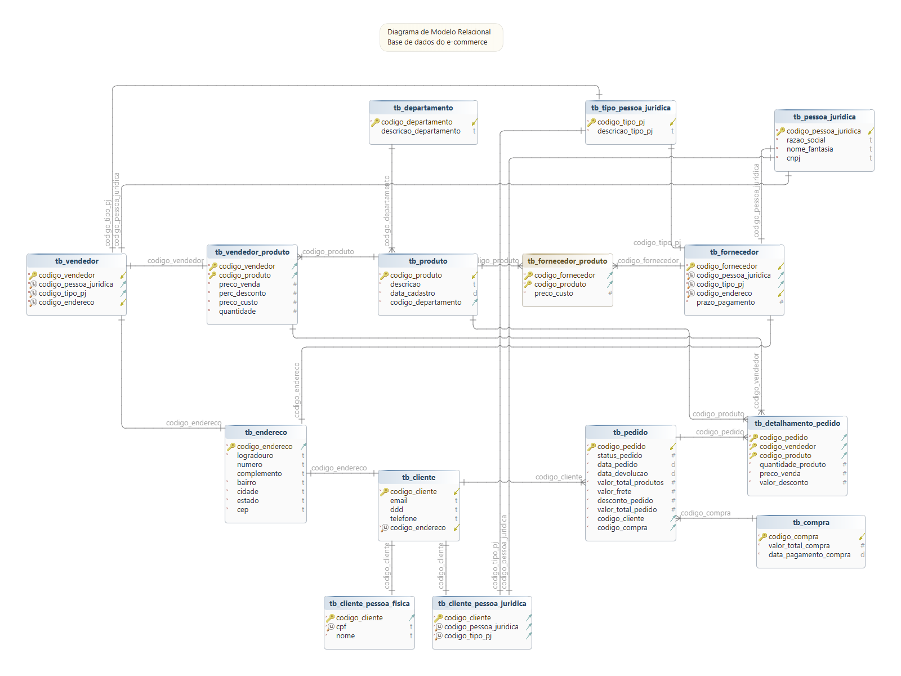

# A atividade faz parte do desafio do curso refinado de projeto de e-commerce

 
 

# Premissas da atividade

## Será modelado as entidades básicas de um e-commerce

 

## As entidades iniciais são:

> Produto

> Estoque

> Cliente

> Pedido

> Fornecedor

> Venda de produtos

## Narrativa - Produto

* Os produtos são vendidos por uma única plataforma online. Contudo, estes podem ter vendedores distintos (terceiros)
* Cada produto possui um fornecedor
* Um ou mais produtos podem compor um pedido

 

## Narrativa - Cliente

* O cliente pode se cadastrar no site com seu CPF ou CNPJ
* O Endereço do cliente irá determinar o valor do frete
* Um cliente pode comprar mais de um pedido. Este tem um período de carência para devolução do produto

 

## Narrativa – Pedido

* O pedidos são criados por clientes e possuem informações de compra, endereço e status da entrega
* Um produto ou mais compoem o pedido
* O pedido pode ser cancelado

 

## Narrativa - Fornecedor e Estoque

* A atividade não descreve a narrativa para as duas Entidades

 
 

# Refinamento da modelagem

 

## A aplicação gerencia o estoque dos vendedores parceiros?

> Cada vendedor tem o próprio estoque e foi definido que a aplicação não calculará o estoque disposnível para Vendedores Parceiros de acordo com as entradas (Forncedores) e saídas (Vendas). O calculo será realizado por outra aplicação e o dado será atualizado na Entidade Estoque

 

## A aplicação apresenta o produto com estoque unificado e somente posteriormente escolhe qual vendedor vai fornecer produto?
	* Exemplo: O Fluxo de compra do Cliente define que primeiro deve-se escolher o produto e depois o Vendedor, ou primeiro escolhe o Vendedor e depois o Produto?

> Cada vendedor tem o próprio estoque

> Fluxo deve ser escolher primeiro o Vendedor e posteriormente o Produto

 

## Faz sentido ter uma Entidade específica de Estoque?

> No modelo lógico os atributos da tabela tb_estoque foram incorporados a tabele de relacionamento tb_vendedor_produto

 

## É necessário fazer uma especialização da Entidade Vendedor?

>Não foi identificado nenhuma atribuição diferenciado entre o Vendedor Principal e Vendedor Parceiro que justifique a criação de tabelas separadas

 

## Em uma mesma compra pode ter produto de vendedores diferentes?

> Embora a aplicação forneça essa possibilidade ao Cliente para a modelagemn de dados, cada Vendedor em uma Compra gerará um Pedido diferente

 

## O valor final da compra deve estar armazenado no Banco de Dados ou gerenciado pela aplicação?

> Deve ser armazenado no Banco de Dados

 
 

# Considerações de atributos derivados

 

## Entidade Pedido

> Embora o atributo valor_total_pedido na Entidade Pedido possa ser derivado dos atributos quantidade, preco_venda, valor_desconto da relação  entre as Entidaes Pedido e Vendedor-Produto, no modelo lógico foi mantido como campo calculado

 

## Entidade Compra

> Embora o atributo valor_total_compra na Entidade Compra possa ser derivado do atributo valor_total_pedido na Entidade Pedido, no modelo lógico foi mantido campo como calculado

 
 

# Modelo Conceitual (Diagrama Entidade Relacionamento)

> O modelo conceitual foi desenvolvido através do aplicativo brModelo

> Caso tenha interesse em usar o diagramam criado pelo aplicativo brModelo, o mesmo pode ser encontrado em "./diagramas/modelo_conceitual.xml"

 

## Digrama do modelo conceitual 

 

# Modelo Lógico (Diagrama Relacionamento)

> Apesar do aplicativo brModelo permita a geração de um Diagrama Relacional, foi utilizado o aplicativo dbSchema, pelo fato do mesmo permitir definir qual será a engine de banco de dados de destino facilitando a geração do modelo físico

> Caso tenha interesse em usar o diagramam criado pelo aplicativo dbSchema, o mesmo pode ser encontrado em "./diagramas/modelo_logico.dbs". Embora o arquivo seja salvo com extensão .dbs, internamente o mesmo é um arquivo XML

 

## Digrama do modelo lógico 

 

## Para acessar um modelo lógico estendido com detalhes de informações de tipo de dados, Unique Key, Foreign Key, etc, clicar no link abaixo

➡️ [Acessar o Modelo Lógico Estendido](docs/modelo_logico_estendido.html)

 
 

# Modelo Físico (Comando SQL)

> A geração dos comandos SQL que permitem a criação das tabelas no SGBD MySQL foi realizada através do aplicativo dbSchema

> Caso tenha interesse no arquivo SQL criado pelo aplicativo dbSchema, o mesmo pode ser encontrado em "./diagramas/modelo_fisico.sql"

 

> Para acessar o modelo físico click abaixo

[Modelo Físico](Modelo_fisico.md)