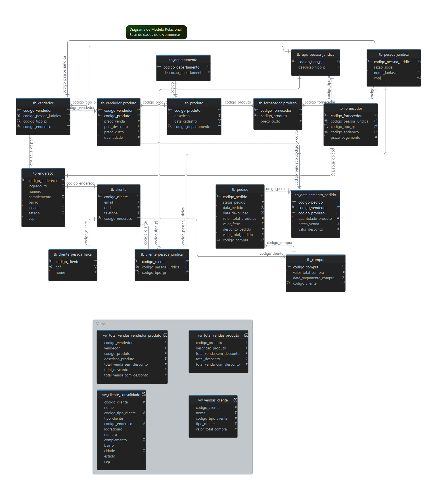

# A atividade faz parte do desafio do curso refinado de projeto de e-commerce

<br>
<br>

# Premissas da atividade

## Será modelado as entidades básicas de um e-commerce

<br>

## As entidades iniciais são:

> Produto

> Estoque

> Cliente

> Pedido

> Fornecedor

> Venda de produtos


## Narrativa - Produto

* Os produtos são vendidos por uma única plataforma online. Contudo, estes podem ter vendedores distintos (terceiros)
* Cada produto possui um fornecedor
* Um ou mais produtos podem compor um pedido

<br>

## Narrativa - Cliente

* O cliente pode se cadastrar no site com seu CPF ou CNPJ
* O Endereço do cliente irá determinar o valor do frete
* Um cliente pode comprar mais de um pedido. Este tem um período de carência para devolução do produto

<br>

## Narrativa – Pedido

* O pedidos são criados por clientes e possuem informações de compra, endereço e status da entrega
* Um produto ou mais compoem o pedido
* O pedido pode ser cancelado

<br>

## Narrativa - Fornecedor e Estoque

* A atividade não descreve a narrativa para as duas Entidades

<br>
<br>

# Refinamento da modelagem

<br>

## A aplicação gerencia o estoque dos vendedores parceiros?

> Cada vendedor tem o próprio estoque e foi definido que a aplicação não calculará o estoque disposnível para Vendedores Parceiros de acordo com as entradas (Forncedores) e saídas (Vendas). O calculo será realizado por outra aplicação e o dado será atualizado na Entidade Estoque

<br>

## A aplicação apresenta o produto com estoque unificado e somente posteriormente escolhe qual vendedor vai fornecer produto?
	* Exemplo: O Fluxo de compra do Cliente define que primeiro deve-se escolher o produto e depois o Vendedor, ou primeiro escolhe o Vendedor e depois o Produto?

> Cada vendedor tem o próprio estoque

> Fluxo deve ser escolher primeiro o Vendedor e posteriormente o Produto

<br>

## Faz sentido ter uma Entidade específica de Estoque?

> No modelo lógico os atributos da tabela tb_estoque foram incorporados a tabele de relacionamento tb_vendedor_produto

<br>

## É necessário fazer uma especialização da Entidade Vendedor?

>Não foi identificado nenhuma atribuição diferenciado entre o Vendedor Principal e Vendedor Parceiro que justifique a criação de tabelas separadas

<br>

## Em uma mesma compra pode ter produto de vendedores diferentes?

> Embora a aplicação forneça essa possibilidade ao Cliente para a modelagemn de dados, cada Vendedor em uma Compra gerará um Pedido diferente

<br>

## O valor final da compra deve estar armazenado no Banco de Dados ou gerenciado pela aplicação?

> Deve ser armazenado no Banco de Dados

<br>
<br>

# Considerações de atributos derivados

<br>

## Entidade Pedido

> Embora o atributo valor_total_pedido na Entidade Pedido possa ser derivado dos atributos quantidade, preco_venda, valor_desconto da relação  entre as Entidaes Pedido e Vendedor-Produto, no modelo lógico foi mantido como campo calculado

<br>

## Entidade Compra

> Embora o atributo valor_total_compra na Entidade Compra possa ser derivado do atributo valor_total_pedido na Entidade Pedido, no modelo lógico foi mantido campo como calculado

<br>
<br>

# Modelo Conceitual (Diagrama Entidade Relacionamento)

> O modelo conceitual foi desenvolvido através do aplicativo brModelo

> Caso tenha interesse em usar o diagramam criado pelo aplicativo brModelo, o mesmo pode ser encontrado em "./diagramas/modelo_conceitual.xml"

<br>

## Digrama do modelo conceitual 


<br>

# Modelo Lógico (Diagrama Relacionamento)

> Apesar do aplicativo brModelo permita a geração de um Diagrama Relacional, foi utilizado o aplicativo dbSchema, pelo fato do mesmo permitir definir qual será a engine de banco de dados de destino facilitando a geração do modelo físico

> Caso tenha interesse em usar o diagramam criado pelo aplicativo dbSchema, o mesmo pode ser encontrado em "./diagramas/modelo_logico.dbs". Embora o arquivo seja salvo com extensão .dbs, internamente o mesmo é um arquivo XML

<br>

## Digrama do modelo lógico 



<br>

## Para acessar um modelo lógico estendido com detalhes de informações de tipo de dados, Unique Key, Foreign Key, etc, clicar no link abaixo

➡️ [Acessar o Modelo Lógico Estendido](docs/modelo_logico_estendido.html)

<br>
<br>

# Modelo Físico (Comando SQL)

> A geração dos comandos SQL que permitem a criação das tabelas no SGBD MySQL foi realizada através do aplicativo dbSchema

> Caso tenha interesse no arquivo SQL criado pelo aplicativo dbSchema, o mesmo pode ser encontrado em "./diagramas/modelo_fisico.sql"

<br>

## Comandos SQL

 ```sql
 CREATE SCHEMA ecommerce;

CREATE  TABLE ecommerce.tb_cliente ( 
	codigo_cliente       INT UNSIGNED   NOT NULL AUTO_INCREMENT   PRIMARY KEY,
	email                VARCHAR(100)       ,
	ddd                  VARCHAR(3)       ,
	telefone             VARCHAR(9)       ,
	codigo_endereco      INT    NOT NULL   ,
	CONSTRAINT unq_tb_cliente UNIQUE ( codigo_endereco ) 
 ) engine=InnoDB;

CREATE  TABLE ecommerce.tb_cliente_pessoa_fisica ( 
	codigo_cliente       INT    NOT NULL   PRIMARY KEY,
	cpf                  VARCHAR(9)    NOT NULL   ,
	nome                 VARCHAR(120)    NOT NULL   ,
	CONSTRAINT unq_tb_cliente_pessoa_fisica UNIQUE ( cpf ) ,
	CONSTRAINT fk_tb_cliente_pessoa_fisica_tb_cliente FOREIGN KEY ( codigo_cliente ) REFERENCES ecommerce.tb_cliente( codigo_cliente ) ON DELETE NO ACTION ON UPDATE RESTRICT
 ) engine=InnoDB;

CREATE  TABLE ecommerce.tb_compra ( 
	codigo_compra        INT UNSIGNED   NOT NULL AUTO_INCREMENT   PRIMARY KEY,
	valor_total_compra   DECIMAL(0,2)    NOT NULL   ,
	data_pagamento_compra DATETIME    NOT NULL   
 ) engine=InnoDB;

CREATE  TABLE ecommerce.tb_departamento ( 
	codigo_departamento  INT UNSIGNED   NOT NULL AUTO_INCREMENT   PRIMARY KEY,
	descricao_departamento VARCHAR(50)       
 ) engine=InnoDB;

CREATE  TABLE ecommerce.tb_estoque ( 
	codigo_produto       INT    NOT NULL   ,
	codigo_vendedor      INT    NOT NULL   ,
	preco_custo          DECIMAL(0,4) UNSIGNED   NOT NULL   ,
	quantidade           INT UNSIGNED   NOT NULL   ,
	CONSTRAINT pk_tb_estoque PRIMARY KEY ( codigo_produto, codigo_vendedor )
 ) engine=InnoDB;

CREATE  TABLE ecommerce.tb_pedido ( 
	codigo_pedido        INT UNSIGNED   NOT NULL AUTO_INCREMENT   PRIMARY KEY,
	status_pedido        INT    NOT NULL   ,
	data_pedido          DATETIME    NOT NULL   ,
	data_devolucao       DATETIME    NOT NULL   ,
	valor_total_produtos DECIMAL(0,4) UNSIGNED   NOT NULL   ,
	valor_frete          DECIMAL(0,2) UNSIGNED   NOT NULL   ,
	desconto_pedido      DECIMAL(0,2) UNSIGNED   NOT NULL   ,
	valor_total_pedido   DECIMAL(0,2) UNSIGNED   NOT NULL   ,
	codigo_cliente       INT    NOT NULL   ,
	codigo_compra        INT    NOT NULL   ,
	CONSTRAINT fk_tb_pedido_tb_cliente FOREIGN KEY ( codigo_cliente ) REFERENCES ecommerce.tb_cliente( codigo_cliente ) ON DELETE NO ACTION ON UPDATE RESTRICT,
	CONSTRAINT fk_tb_pedido_tb_compra FOREIGN KEY ( codigo_compra ) REFERENCES ecommerce.tb_compra( codigo_compra ) ON DELETE NO ACTION ON UPDATE RESTRICT
 ) engine=InnoDB;

CREATE  TABLE ecommerce.tb_pessoa_juridica ( 
	codigo_pessoa_juridica INT UNSIGNED   NOT NULL AUTO_INCREMENT   PRIMARY KEY,
	razao_social         VARCHAR(100)    NOT NULL   ,
	nome_fantasia        VARCHAR(100)    NOT NULL   ,
	cnpj                 VARCHAR(14)    NOT NULL   
 ) engine=InnoDB;

CREATE  TABLE ecommerce.tb_produto ( 
	codigo_produto       INT UNSIGNED   NOT NULL AUTO_INCREMENT   PRIMARY KEY,
	descricao            VARCHAR(50)    NOT NULL   ,
	data_cadastro        DATE    NOT NULL   ,
	codigo_departamento  INT UNSIGNED   NOT NULL   ,
	CONSTRAINT fk_tb_produto_tb_departamento FOREIGN KEY ( codigo_departamento ) REFERENCES ecommerce.tb_departamento( codigo_departamento ) ON DELETE NO ACTION ON UPDATE RESTRICT
 ) engine=InnoDB;

CREATE  TABLE ecommerce.tb_tipo_pessoa_juridica ( 
	codigo_tipo_pj       INT UNSIGNED   NOT NULL AUTO_INCREMENT   PRIMARY KEY,
	descricao_tipo_pj    VARCHAR(30)    NOT NULL   
 ) engine=InnoDB;

CREATE  TABLE ecommerce.tb_vendedor ( 
	codigo_vendedor      INT UNSIGNED   NOT NULL AUTO_INCREMENT   PRIMARY KEY,
	codigo_pessoa_juridica INT    NOT NULL   ,
	codigo_tipo_pj       INT    NOT NULL   ,
	codigo_endereco      INT    NOT NULL   ,
	CONSTRAINT unq_tb_vendedor UNIQUE ( codigo_pessoa_juridica ) ,
	CONSTRAINT unq_tb_vendedor_0 UNIQUE ( codigo_endereco ) ,
	CONSTRAINT unq_tb_vendedor_1 UNIQUE ( codigo_tipo_pj ) ,
	CONSTRAINT fk_tb_vendedor_tb_pessoa_juridica FOREIGN KEY ( codigo_pessoa_juridica ) REFERENCES ecommerce.tb_pessoa_juridica( codigo_pessoa_juridica ) ON DELETE NO ACTION ON UPDATE RESTRICT,
	CONSTRAINT fk_tb_vendedor_tb_tipo_pessoa_juridica FOREIGN KEY ( codigo_tipo_pj ) REFERENCES ecommerce.tb_tipo_pessoa_juridica( codigo_tipo_pj ) ON DELETE NO ACTION ON UPDATE NO ACTION
 ) engine=InnoDB;

CREATE  TABLE ecommerce.tb_vendedor_produto ( 
	codigo_vendedor      INT    NOT NULL   ,
	codigo_produto       INT    NOT NULL   ,
	preco_venda          DECIMAL(0,2) UNSIGNED   NOT NULL   ,
	perc_desconto        DECIMAL(0,4)    NOT NULL   ,
	preco_custo          DECIMAL(0,4) UNSIGNED   NOT NULL   ,
	quantidade           INT UNSIGNED   NOT NULL   ,
	CONSTRAINT pk_tb_vendedor_produto PRIMARY KEY ( codigo_vendedor, codigo_produto ),
	CONSTRAINT unq_tb_vendedor_produto_codigo_vendedor UNIQUE ( codigo_vendedor ) ,
	CONSTRAINT fk_tb_vendedor_produto_tb_vendedor FOREIGN KEY ( codigo_vendedor ) REFERENCES ecommerce.tb_vendedor( codigo_vendedor ) ON DELETE NO ACTION ON UPDATE RESTRICT,
	CONSTRAINT fk_tb_vendedor_produto_tb_produto FOREIGN KEY ( codigo_produto ) REFERENCES ecommerce.tb_produto( codigo_produto ) ON DELETE NO ACTION ON UPDATE NO ACTION
 ) engine=InnoDB;

CREATE  TABLE ecommerce.tb_cliente_pessoa_juridica ( 
	codigo_cliente       INT    NOT NULL   PRIMARY KEY,
	codigo_pessoa_juridica INT    NOT NULL   ,
	codigo_tipo_pj       INT    NOT NULL   ,
	CONSTRAINT unq_tb_cliente_pessoa_juridica UNIQUE ( codigo_pessoa_juridica ) ,
	CONSTRAINT unq_tb_cliente_pessoa_juridica_0 UNIQUE ( codigo_tipo_pj ) ,
	CONSTRAINT fk_tb_cliente_pessoa_juridica_tb_cliente FOREIGN KEY ( codigo_cliente ) REFERENCES ecommerce.tb_cliente( codigo_cliente ) ON DELETE NO ACTION ON UPDATE NO ACTION,
	CONSTRAINT fk_tb_cliente_pessoa_juridica_tb_pessoa_juridica FOREIGN KEY ( codigo_pessoa_juridica ) REFERENCES ecommerce.tb_pessoa_juridica( codigo_pessoa_juridica ) ON DELETE NO ACTION ON UPDATE RESTRICT,
	CONSTRAINT fk_tb_cliente_pessoa_juridica_tb_tipo_pessoa_juridica FOREIGN KEY ( codigo_tipo_pj ) REFERENCES ecommerce.tb_tipo_pessoa_juridica( codigo_tipo_pj ) ON DELETE NO ACTION ON UPDATE NO ACTION
 ) engine=InnoDB;

CREATE  TABLE ecommerce.tb_detalhamento_pedido ( 
	codigo_pedido        INT    NOT NULL   ,
	codigo_vendedor      INT    NOT NULL   ,
	codigo_produto       INT    NOT NULL   ,
	quantidade_produto   INT UNSIGNED   NOT NULL   ,
	preco_venda          DECIMAL(0,2) UNSIGNED   NOT NULL   ,
	valor_desconto       DECIMAL(0,2)    NOT NULL   ,
	CONSTRAINT pk_tb_detalha_pedido PRIMARY KEY ( codigo_pedido, codigo_vendedor, codigo_produto ),
	CONSTRAINT fk_tb_detalhamento_pedido_tb_pedido FOREIGN KEY ( codigo_pedido ) REFERENCES ecommerce.tb_pedido( codigo_pedido ) ON DELETE NO ACTION ON UPDATE RESTRICT,
	CONSTRAINT fk_tb_detalhamento_pedido_tb_produto FOREIGN KEY ( codigo_produto ) REFERENCES ecommerce.tb_produto( codigo_produto ) ON DELETE NO ACTION ON UPDATE RESTRICT,
	CONSTRAINT fk_tb_detalhamento_pedido_tb_vendedor_produto FOREIGN KEY ( codigo_vendedor ) REFERENCES ecommerce.tb_vendedor_produto( codigo_vendedor ) ON DELETE NO ACTION ON UPDATE RESTRICT
 ) engine=InnoDB;

CREATE  TABLE ecommerce.tb_fornecedor ( 
	codigo_fornecedor    INT UNSIGNED   NOT NULL AUTO_INCREMENT   PRIMARY KEY,
	codigo_pessoa_juridica INT    NOT NULL   ,
	codigo_tipo_pj       INT    NOT NULL   ,
	codigo_endereco      INT    NOT NULL   ,
	prazo_pagamento      INT UNSIGNED   NOT NULL   ,
	CONSTRAINT unq_tb_fornecedor UNIQUE ( codigo_pessoa_juridica ) ,
	CONSTRAINT unq_tb_fornecedor_0 UNIQUE ( codigo_endereco ) ,
	CONSTRAINT unq_tb_fornecedor_1 UNIQUE ( codigo_tipo_pj ) ,
	CONSTRAINT fk_tb_fornecedor_tb_pessoa_juridica FOREIGN KEY ( codigo_pessoa_juridica ) REFERENCES ecommerce.tb_pessoa_juridica( codigo_pessoa_juridica ) ON DELETE NO ACTION ON UPDATE NO ACTION,
	CONSTRAINT fk_tb_fornecedor_tb_tipo_pessoa_juridica FOREIGN KEY ( codigo_tipo_pj ) REFERENCES ecommerce.tb_tipo_pessoa_juridica( codigo_tipo_pj ) ON DELETE NO ACTION ON UPDATE RESTRICT
 ) engine=InnoDB;

CREATE  TABLE ecommerce.tb_fornecedor_produto ( 
	codigo_fornecedor    INT    NOT NULL   ,
	codigo_produto       INT    NOT NULL   ,
	preco_custo          DECIMAL(0,4)    NOT NULL   ,
	CONSTRAINT pk_tb_fornecedor_produto PRIMARY KEY ( codigo_fornecedor, codigo_produto ),
	CONSTRAINT fk_tb_fornecedor_produto_tb_produto FOREIGN KEY ( codigo_produto ) REFERENCES ecommerce.tb_produto( codigo_produto ) ON DELETE NO ACTION ON UPDATE NO ACTION,
	CONSTRAINT fk_tb_fornecedor_produto_tb_fornecedor FOREIGN KEY ( codigo_fornecedor ) REFERENCES ecommerce.tb_fornecedor( codigo_fornecedor ) ON DELETE NO ACTION ON UPDATE NO ACTION
 ) engine=InnoDB;

CREATE  TABLE ecommerce.tb_endereco ( 
	codigo_endereco      INT UNSIGNED   NOT NULL AUTO_INCREMENT   PRIMARY KEY,
	logradouro           VARCHAR(125)    NOT NULL   ,
	numero               VARCHAR(10)       ,
	complemento          VARCHAR(100)       ,
	bairro               VARCHAR(100)    NOT NULL   ,
	cidade               VARCHAR(100)    NOT NULL   ,
	estado               VARCHAR(35)    NOT NULL   ,
	cep                  VARCHAR(8)    NOT NULL   ,
	CONSTRAINT fk_tb_endereco_tb_cliente FOREIGN KEY ( codigo_endereco ) REFERENCES ecommerce.tb_cliente( codigo_endereco ) ON DELETE NO ACTION ON UPDATE RESTRICT,
	CONSTRAINT fk_tb_endereco_tb_vendedor FOREIGN KEY ( codigo_endereco ) REFERENCES ecommerce.tb_vendedor( codigo_endereco ) ON DELETE NO ACTION ON UPDATE RESTRICT,
	CONSTRAINT fk_tb_endereco_tb_fornecedor FOREIGN KEY ( codigo_endereco ) REFERENCES ecommerce.tb_fornecedor( codigo_endereco ) ON DELETE NO ACTION ON UPDATE RESTRICT
 ) engine=InnoDB;

