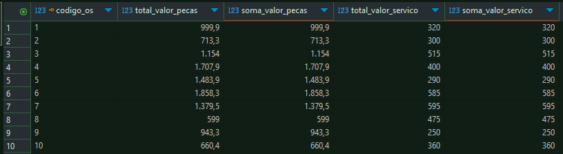
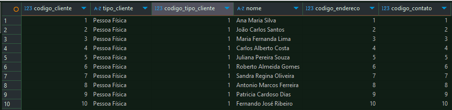
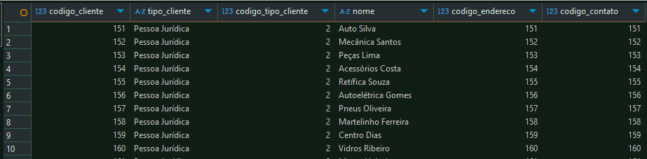
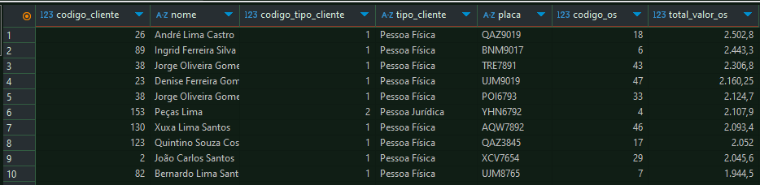
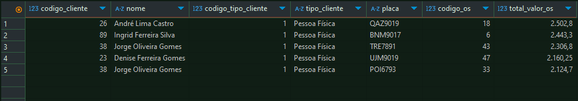
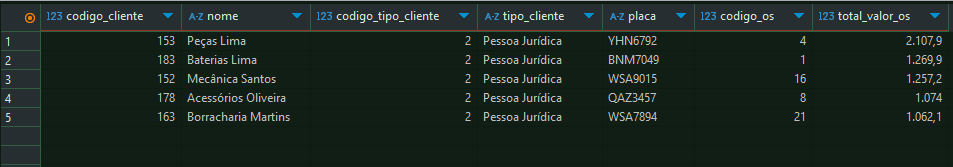
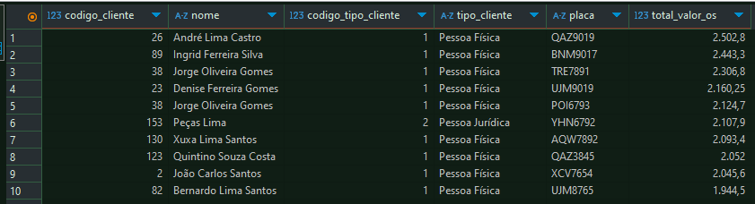
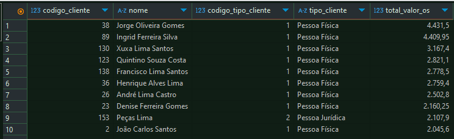

# Exemplos de consultas que podem ser realizadas na base de dados - Oficina

### Verificar consistência de valores entre as tabelas de ordem de serviço e detalhamento da Ordem de Serviço por Peças e Serviços

```sql
WITH

consolidacao_pecas as (
	SELECT 
		t.codigo_os
		,sum(t.quantidade * t.valor_peca_os) as soma_valor_pecas
	FROM 
		tb_detalhamento_os_peca as t
	GROUP BY 1	
)

,consolidacao_servico as (
	SELECT 
		t.codigo_os
		,sum(t.quantidade * t.valor_servico_os) as soma_valor_servico
	FROM 
		tb_detalhamento_os_servico as t
	GROUP BY 1	
)


SELECT 
	tos.codigo_os
	,tos.total_valor_pecas
	,cp.soma_valor_pecas
	,tos.total_valor_servico
	,cs.soma_valor_servico

FROM 
	tb_ordem_servico as tos 
	LEFT JOIN consolidacao_pecas as cp on (tos.codigo_os = cp.codigo_os)
	LEFT JOIN consolidacao_servico as cs on (tos.codigo_os = cs.codigo_os)

WHERE
	tos.total_valor_pecas <> cp.soma_valor_pecas
	OR 	tos.total_valor_servico <> cs.soma_valor_servico
```
#### Consulta sem a cláusula WHERE exibindo valores consistentes entre Ordem de Serviço e o detalhamento por Peças e Serviços

#### Retorna da consulta



<br>

### Criação de view consolidada de Clientes Pessoa Física e Clientes Pessoa Jurídica

```sql
CREATE VIEW IF NOT EXISTS vw_clientes_consolidado as (

	SELECT
		cli.codigo_cliente
		,IF(pf.nome_cliente IS NULL, 'Pessoa Jurídica', 'Pessoa Física') as tipo_cliente
		,IF(pf.nome_cliente IS NULL, 2, 1) as codigo_tipo_cliente
		,IF(pf.nome_cliente IS NULL, pj.nome_fantasia, pf.nome_cliente) as nome
		,cli.codigo_endereco
		,cli.codigo_contato
	
	FROM
		tb_cliente as cli
		LEFT JOIN tb_pessoa_fisica as pf on (cli.codigo_cliente = pf.codigo_cliente)
		LEFT JOIN tb_pessoa_juridica as pj on (cli.codigo_cliente = pj.codigo_cliente)
);
```

#### Consulta na view Pessoa Física

```sql
SELECT 
	cc.*
	
FROM 
	vw_clientes_consolidado as cc
	
WHERE
	cc.codigo_tipo_cliente = 1
```
#### Retorna da consulta



<br>


#### Consulta na view Pessoa Jurídica

```sql
SELECT 
	cc.*
	
FROM 
	vw_clientes_consolidado as cc
	
WHERE
	cc.codigo_tipo_cliente = 2
```
#### Retorna da consulta



<br>


### Consulta Consolidada de Valor de Ordem de Serviço

#### Para facilicar consultas e reutilização em outras consultas foi criado uma view

```sql
CREATE VIEW IF NOT EXISTS vw_total_valor_os as (
	SELECT 
		cli.codigo_cliente
		,cli.nome
		,cli.codigo_tipo_cliente
		,cli.tipo_cliente
		,tv.placa
		,tos.codigo_os
		,tos.total_valor_os
	FROM 
		vw_clientes_consolidado	as cli
		INNER JOIN tb_veiculo as tv on (cli.codigo_cliente = tv.codigo_cliente)
		INNER JOIN tb_ordem_servico tos on (tv.codigo_veiculo = tos.codigo_veiculo )
		
	ORDER BY
		tos.total_valor_os DESC
);

```

#### Consulta TOP 10 Valor de Ordem de Serviço

```sql
SELECT
	*
FROM 
	vw_total_valor_os
LIMIT 10
```

#### Retorna da consulta




#### Consulta TOP 5 Valor de Ordem de Serviço Pessoa Física

```sql
SELECT
	*
FROM 
	vw_total_valor_os
WHERE
	codigo_tipo_cliente = 1
LIMIT 5
```

#### Retorna da consulta




#### Consulta TOP 5 Valor de Ordem de Serviço Pessoa Jurídica

```sql
SELECT
	*
FROM 
	vw_total_valor_os
WHERE
	codigo_tipo_cliente = 2
LIMIT 5
```

#### Retorna da consulta




### Consulta consolidada de Valor de Ordem de Serviço por Veículo e consolidada por Cliente

#### Criação da view consolidada por Veículo

#### Obs.: Um cliente pode levar o mesmo veículo mais de uma vez na Oficina

```sql
CREATE VIEW IF NOT EXISTS vw_total_valor_os_veiculo as (
	SELECT
		codigo_cliente
		,nome
		,codigo_tipo_cliente
		,tipo_cliente
		,placa
		,sum(total_valor_os) as total_valor_os
	FROM 
		vw_total_valor_os 
	GROUP BY 1, 2, 3, 4, 5
	
	ORDER BY 
		total_valor_os DESC
);
```

#### Criação da view consolidada por Cliente

#### Obs.: Um cliente pode levar o mesmo veículo mais de uma vez na Oficina e ter mais de um veículo

```sql
CREATE VIEW IF NOT EXISTS vw_total_valor_os_cliente as (
	SELECT
		codigo_cliente
		,nome
		,codigo_tipo_cliente
		,tipo_cliente
		,sum(total_valor_os) as total_valor_os
	FROM 
		vw_total_valor_os 
	GROUP BY 1, 2, 3, 4
	
	ORDER BY 
		total_valor_os DESC
);
```


#### Consulta TOP 10 Valor de Ordem de Serviço por Veículo

```sql
SELECT 
	*
FROM 
	vw_total_valor_os_veiculo
LIMIT 10
```

#### Retorna da consulta




#### Consulta TOP 10 Valor de Ordem de Serviço por Cliente

```sql
SELECT 
	*
FROM 
	vw_total_valor_os_cliente
LIMIT 10
```

#### Retorna da consulta




<br>
<br>

[Retornar README principal](../README.md)