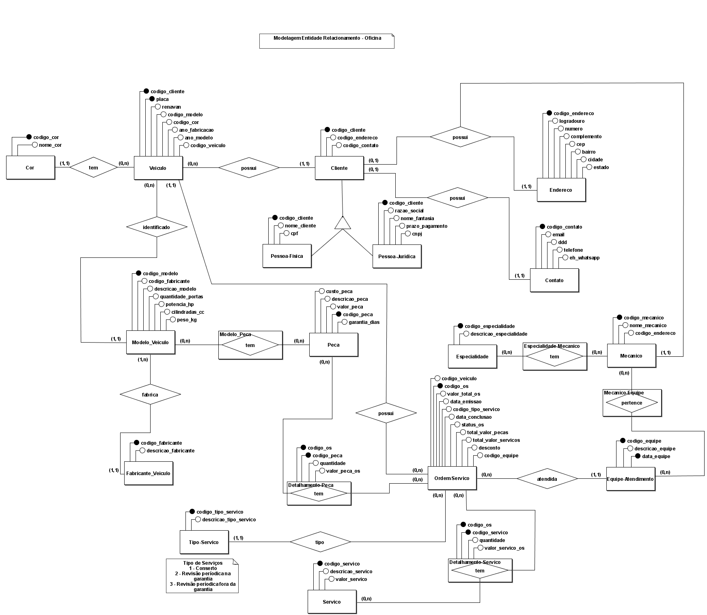

# Modelo Conceitual (Diagrama Entidade Relacionamento)

> O modelo conceitual de Oficina foi desenvolvido através do aplicativo brModelo

> Caso tenha interesse em usar o diagramam criado pelo aplicativo brModelo, o mesmo pode ser encontrado em "/oficina/diagramas/modelo_conceitual.xml"

 

## Digrama do modelo conceitual - Oficina

 

[Retornar README principal](../README.md)

[Retornar README Oficina](README.md)